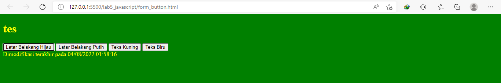
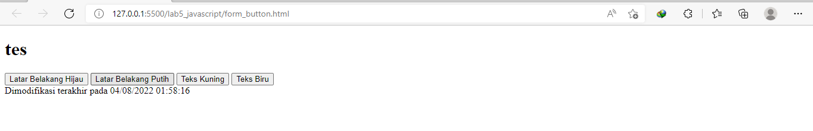

# Langkah pengenalan JavaScript

```Html
<!DOCTYPE html>
<html lang="en">
  <head>
    <meta charset="UTF-8" />
    <meta http-equiv="X-UA-Compatible" content="IE=edge" />
    <meta name="viewport" content="width=device-width, initial-scale=1.0" />
    <title>Mengenal JavaScript</title>
  </head>
  <body>
    <h1>Pengenalan JavaScript</h1>
    <h3>Contoh document.write dan console.log</h3>
    <script>
      document.write("Hello World");
      console.log("Hello World");
    </script>
  </body>
</html>
```

Ini hasilnya setelah saya jalankan.


# Java Script Dasar

## pemakaian Alert sebagai property window.

```Html
<!DOCTYPE html>
<html lang="en">
  <head>
    <meta charset="UTF-8" />
    <meta http-equiv="X-UA-Compatible" content="IE=edge" />
    <meta name="viewport" content="width=device-width, initial-scale=1.0" />
    <title>alert box</title>
  </head>
  <body>
    <script language="JavaScript">
      <!--
      window.alert("ini merupakan pesan untuk anda");
      //-->
    </script>
  </body>
</html>
```

Ini hasilnya setelah saya jalankan


## Pemakaian method dalam objek

```Html
<!DOCTYPE html>
<html lang="en">
  <head>
    <meta charset="UTF-8" />
    <meta http-equiv="X-UA-Compatible" content="IE=edge" />
    <meta name="viewport" content="width=device-width, initial-scale=1.0" />
    <title>skrip javascript</title>
  </head>
  <body>
    percobaan memakai javascript;<br />
    <script languane="javascript">
      <!--
      document.write("selamat mencoba javascript<br>");
      document.write("semoga sukses!");
      -->
    </script>
  </body>
</html>
```

Ini hasilnya setelah saya jalankan.


## Pemakaian Prompt

```Html
<!DOCTYPE html>
<html lang="en">
<head>
    <meta charset="UTF-8">
    <meta http-equiv="X-UA-Compatible" content="IE=edge">
    <meta name="viewport" content="width=device-width, initial-scale=1.0">
    <title>Pemasukan Data</title>
</head>
<body>
    <script language = "javascript">
        <!--
            var nama = prompt("siapa nama anda?","masukan nama anda");
            document.write("hai, " + nama)
            -->
    </script>
</body>
</html>
```

Ini hasilnya setelah saya jalankan


## Pembuatan fungsi dan cara pemanggilannya

```Html
<!DOCTYPE html>
<html lang="en">
  <head>
    <meta charset="UTF-8" />
    <meta http-equiv="X-UA-Compatible" content="IE=edge" />
    <meta name="viewport" content="width=device-width, initial-scale=1.0" />
    <title>contoh program javascript</title>
    <script language="javascript">
      function pesan() {
        alert("memanggil javascript lewat body onload");
      }
    </script>
  </head>
  <body onload="pesan()"></body>
</html>
```

Ini hasil setelah saya jalankan


# Dasar Pemrograman Di javascript

## Operasi dasar aritmatika

```Html
<!DOCTYPE html>
<html lang="en">
  <head>
    <meta charset="UTF-8" />
    <meta http-equiv="X-UA-Compatible" content="IE=edge" />
    <meta name="viewport" content="width=device-width, initial-scale=1.0" />
    <title>contoh program javascript</title>
    <script lang="javascript">
      function test(val1, val2) {
        document.write("<br>" + "perkalian : val1*val2" + "<br>")
        document.write(val1 * val2);
        document.write("<br>" + "pembagian : val1/val2 " + "<br>")
        document.write(val1 / val2);
        document.write("<br>" + "penjumlahann : val+val2" + "<br>")
        document.write(val1 + val2);
        document.write("<br>" + "pengurangan : val1-val2 " + "<br>")
        document.write(Val1 - val2);
        document.write("<br>" + "modulus : val1%val2" + "<br>");
        document.write(val1 % val2);
      }
    </script>
  </head>
  <body>
    <input
      type="button"
      name="button1"
      value="arithmetic"
      onclick="test(9,4)">
  </body>
</html>
```

Ini hasilnya setelah saya jalankan.


## Seleksi kondisi (if..else)

```Html
<!DOCTYPE html>
<html lang="en">
<head>
    <meta charset="UTF-8">
    <meta http-equiv="X-UA-Compatible" content="IE=edge">
    <meta name="viewport" content="width=device-width, initial-scale=1.0">
    <title>contoh if-else</title>
</head>
<body>
    <script lang="javascript">
<!--
    var nilai = prompt("nilai (0-100): ", 0);
    var hasil = "";
    if (nilai >= 60)
    hasil = "lulus";
    else
    hasil = "tidak lulus";
    document.write("hasil: " + hasil);
    //-->
    </script>
</body>
</html>
```

Ini hasilnya setelah saya jalankan


## Penggunaan operator switch untuk seleksi kondisi

```Html
<!DOCTYPE html>
<html lang="en">
  <head>
    <meta charset="UTF-8" />
    <meta http-equiv="X-UA-Compatible" content="IE=edge" />
    <meta name="viewport" content="width=device-width, initial-scale=1.0" />
    <title>contoh program javascript</title>
    <script lang="javascript">
      {
          val1=window.prompt("input nilai (1-5): ")
          switch (val1)
          {
              case "1" :
                  document.write("bilangan satu")
                  break
              case "2" :
              document.write("bilangan dua")
                  break
              case "3" :
              document.write("bilangan tiga")
              break
              case "4" :
                  document.write("bilangan empat")
              break
              case "5" :
                  document.write("bilangan lima")
                  break
              default :
              document.write("bilangan lainnya")

          }
      }
    </script>
  </head>
  <body>
    <input type="button" name="button1" value="switch" onclick="test()" />
  </body>
</html>
```

Ini hasilnya setelah saya jalankan


# Membuat From

## From Input

```Html
<!DOCTYPE html>
<html lang="en">
<head>
    <meta charset="UTF-8">
    <meta http-equiv="X-UA-Compatible" content="IE=edge">
    <meta name="viewport" content="width=device-width, initial-scale=1.0">
    <title>Pemasukan Data</title>
</head>
<body>
    <script language = "javascript">
        <!--
            var nama = prompt("siapa nama anda?","masukan nama anda");
            document.write("hai, " + nama)
            -->
    </script>
</body>
</html>
```

Ini hasilnya setelah saya jalankan


## Form Button

```Html
<!DOCTYPE html>
<html lang="en">
  <head>
    <meta charset="UTF-8" />
    <meta http-equiv="X-UA-Compatible" content="IE=edge" />
    <meta name="viewport" content="width=device-width, initial-scale=1.0" />
    <title>objek document</title>
  </head>
  <body>
    <script lang="javascript">
      <!--
          function ubahWarnaLB(warna) {
              document.bgColor=warna;
          }
          function ubahWarnaLD(warna) {
              document.fgColor=warna;
          }
          //-->
    </script>
    <h1>tes</h1>
    <form>
      <input
        type="button"
        value="Latar Belakang Hijau"
        onclick="ubahWarnaLB('GREEN')"
      />
      <input
        type="button"
        value="Latar Belakang Putih"
        onclick="ubahWarnaLB('WHITE')"
      />
      <input
        type="button"
        value="Teks Kuning"
        onclick="ubahWarnaLD('YELLOW')"
      />
      <input type="button" value="Teks Biru" onclick="ubahWarnaLD('BLUE')" />
    </form>
    <script lang="javascript">
      <!--
      document.write("Dimodifikasi terakhir pada " + document.lastModified);
      //-->
    </script>
  </body>
</html>
```

Ini hasilnya setelah saya jalankan

- Latar Belakang Hijau
  
- Latar Belakang Putih
  
- Teks Kuning
  
- Teks Biru
  

# HTML DOM

Pilihan menggunakan checkBox dengan perhitungan otomatis
```Html
<!DOCTYPE html>
<html lang="en">
  <head>
    <meta charset="UTF-8" />
    <meta http-equiv="X-UA-Compatible" content="IE=edge" />
    <meta name="viewport" content="width=device-width, initial-scale=1.0" />
    <title>Daftar Menu</title>
    <script>
      function hitung(ele) {
        var total = document.getElementById("total").value;
        total = total ? parseInt(total) : 0;
        var harga = 0;
        if (ele.checked0) {
          harga = ele.value;
          total += parseInt(harga);
        } else {
          harga = ele.value;
          if (total > 0) total -= parseInt(harga);
        }
        document.getElementById("total").value = total; 
      }
    </script>
  </head>
  <body>
    <h1>Daftar Menu Makanan</h1>
    <label><input type="checkbox" value="5000" id="menu1" onclick="hitung(this);"/>Ayam Goreng Rp. 5.000</label><br/>
    <label><input type="checkbox" value="500" id="menu2" onclick="hitung(this);"/>Tempe Goreng Rp. 500</label><br/>
    <label><input type="checkbox" value="2500" id="menu3" onclick="hitung(this);"/>Telur Dadar Rp. 2.500</label><hr/>
    <strong>Total Bayar: Rp. <input id="total" type="text"/></strong>
  </body>
  </body>
  </body>
</html>
```
Ini hasilnya setelah saya jalankan
